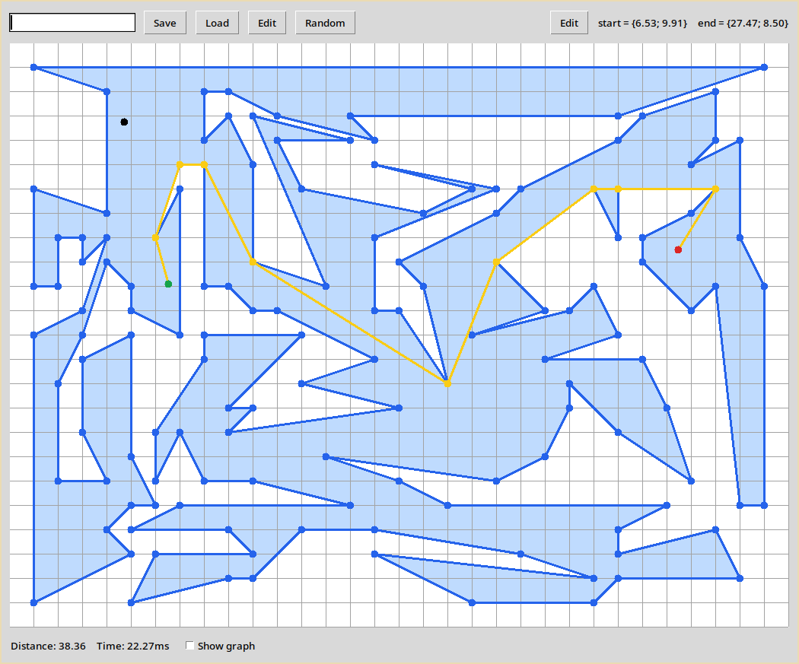
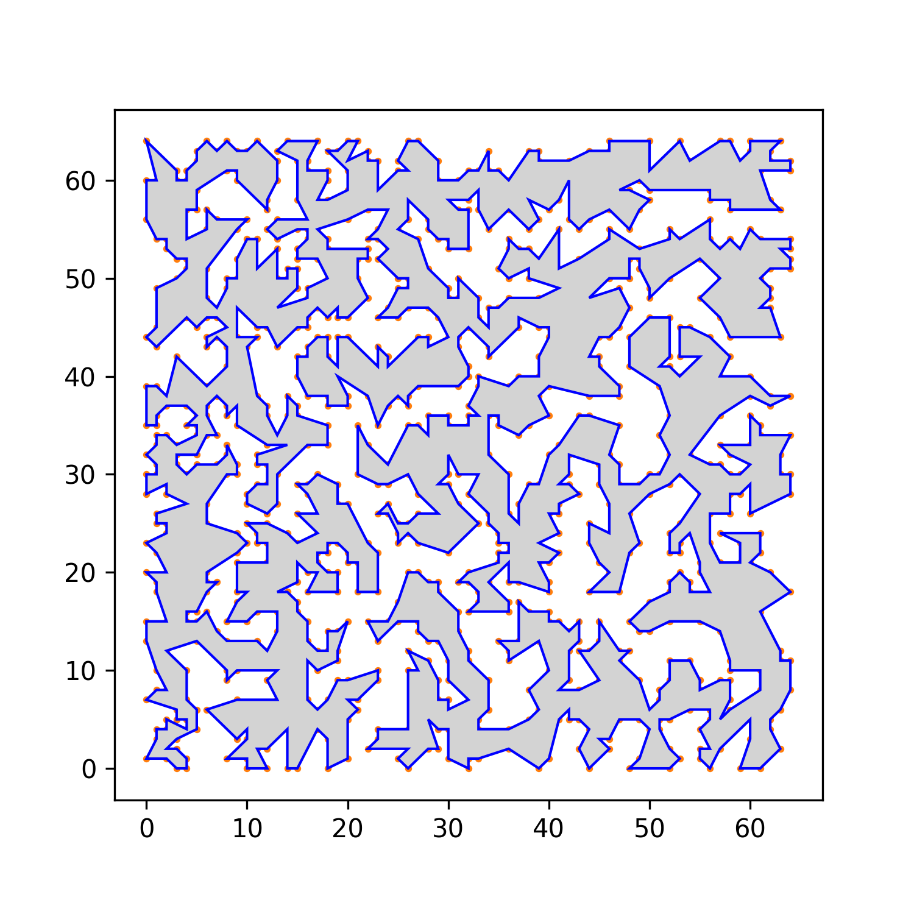

## Nội dung chính

1. Lập trình giao diện
2. Bố cục chương trình
3. Biểu diễn dữ liệu
4. Các thuật toán
5. Tham khảo

# Xây dựng giao diện

## Thư viện Tkinter

- Tkinter là binding python cho bộ công cụ giao diện Tcl/Tk.
- Một số đặc điểm của Tkinter
    - Native
    - Đa nền tảng
    - Hướng đối tượng, dựa trên event-callback

## Ưu điểm

---

Có hệ thống quản lý bố cục đơn giản nhưng mạnh mẽ


---

Code ngắn gọn, dễ đọc

```python
import tkinter as tk

root = tk.Tk()

count = tk.IntVar(value=0)
increment = lambda: count.set(count.get() + 1)

btn = tk.Button(root, textvariable=count, command=increment)
btn.pack(padx=24, pady=24)

root.mainloop()
```

---

Có sự đồng nhất với các ứng dụng khác

{ height=512px }

---

## Nhược điểm

- Có sự khác biệt khi chạy code trên các nền tảng khác nhau
- Ít được đầu tư hơn các thư viện giao diện khác 
- Không thích hợp cho các ứng dụng tương tác cao

# Bố cục chương trình

## Giao diện

{ height=512px }

## Quy trình vẽ

1. Tô màu đa giác
2. Vẽ lưới tọa độ
3. Vẽ đồ thị
4. Vẽ viền đa giác
5. Vẽ đường đi tìm được
6. Vẽ điểm bắt đầu và kết thúc
7. Vẽ con trỏ chuột

# Biểu diễn dữ liệu

## Đơn vị hình học cơ bản

- Điểm: ($x$, $y$)
- Đoạn thẳng: ($p_1$, $p_2$)
- Đa giác: \[$p_0$, $p_1$, $p_2$, ..., $p_n$, $p_0$\]
  - $p_i$, $p_{i+1}$, $p_{i+2}$ không được thẳng hàng.
  - Đa giác không được tự cắt

## Đồ thị

```python
# khởi tạo
graph = {}

# thêm đỉnh
if n not in graph:
  graph[n] = {}

# thêm cạnh (a, b phải tồn tại trong đồ thị)
graph[a][b] = w
graph[b][a] = w

# lặp qua tất cả những cạnh kề
for i in graph[n]:
  pass
```

# Các thuật toán

## Sinh đồ thị

- Tất cả cạnh của đa giác là cạnh của đồ thị
- 2 điểm $A$, $B$ trên đa giác có cạnh trên đồ thị nếu
  - $AB$ không cắt bất kỳ cạnh nào của đa giác
  - Trung điểm $AB$ nằm trong đa giác
- Độ phức tạp: $O(N^3)$

## Tìm đường (A*)

- Là bản mở rộng của dijkstra
- Sử dụng heuristic
- Thích hợp hơn cho việc tìm khoảng cách giữa 2 điểm
- Độ phức tạp: $O(N*\log{N})$

---

```python
def a_star(start, end):
  open.put((h[start], start))

  while not open.empty():
    f_v, v = open.get()
    if v == end:
      return f_v
    
    for adj in graph[v]:
      g[adj] = g[v] + graph[v][adj]
      f[adj] = g[adj] + h[adj]
      open.put((f[adj], adj))

  return -1
```

---

| Dijkstra | A* |
| -------- | -- |
| { height=256px } | { height=256px } |
| { height=256px } | { height=256px } |

## Sinh đa giác

- Tạo tập hợp điểm ngẫu nhiên
- Nối tất cả các điểm sao cho không cặp cạnh nào tự cắt
- Một trong những cách nối là nối sao cho chu vi là ngắn nhất
- $\Rightarrow$ Trở thành bài toán TSP

---

- Sử dụng thuật toán 2-opt để ước tính nghiệm
- Độ phức tạp: ~$O(N^3)$

{ height=512px }

---

{ height=512px }

# Tham khảo

## Tài liệu

- Thông tin cơ bản: <https://wikipedia.org/>
- Tkinter: <http://effbot.org/tkinterbook/> (Đã ngưng hoạt động)
- A*: <https://theory.stanford.edu/~amitp/GameProgramming/>

## Thư viện sử dụng

- Numba: Python compiler sử dụng LLVM. Dùng để tăng tốc độ các phép tính hình học.
